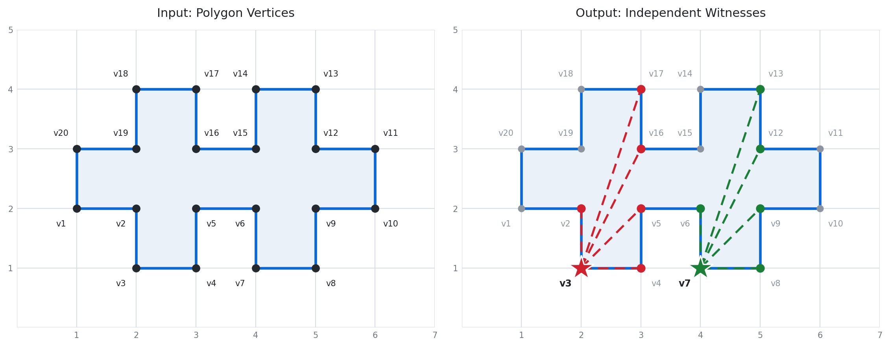
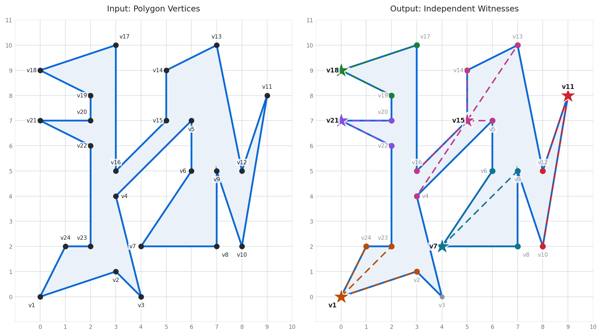

# Computational Geometry Project

**Computing a "large" number of independent witness points with respect to vertex guards in a simple polygon.**

Final project for **CSE 555: Computational Geometry** at Stony Brook University, taught by Professor Joseph Mitchell, Spring 2024. Written in Java. The project was selected by the professor as one of the best submissions in the class and was awarded a performance bonus.

📄 **[Project slides (PDF)](docs/CSE555-Project-Slides.pdf)**

This README assumes no background in computational geometry. The Background section builds up every idea the project depends on, starting from scratch. If you already know the art gallery material, skip ahead to [The Problem](#the-problem).

## Contents

- [Background: the ideas you need first](#background-the-ideas-you-need-first)
- [The Problem](#the-problem)
- [What Does "Large" Mean?](#what-does-large-mean)
- [How the Algorithm Works](#how-the-algorithm-works)
- [Using Symmetry to Cut the Running Time](#using-symmetry-to-cut-the-running-time)
- [Time Complexity](#time-complexity)
- [Examples](#examples)
- [How to Run](#how-to-run)
- [Files](#files)
- [References](#references)

## Background: the ideas you need first

### Polygons and vertices

A **polygon** is a closed shape made of straight line segments. The corners are called **vertices** (a single one is a *vertex*), and the straight segments connecting them are called **edges**.

In this project a polygon is described purely as a list of its vertices in `(x, y)` coordinates, written in the order you would walk around its boundary. For example, `(0,0),(4,0),(4,3),(0,3)` describes a rectangle. The program assumes each vertex connects to the next one in the list, and that the last vertex connects back around to the first.

### Simple polygons

A polygon is **simple** if its boundary never crosses itself. Picture a rubber band laid flat on a table: it can be stretched into all sorts of lumpy shapes, but as long as it never overlaps itself, the shape is simple. A figure eight is *not* simple, because the boundary crosses in the middle.

Simple polygons have one property that this project depends on: there is a clear, unambiguous "inside" and "outside."

Every input polygon here is assumed to be simple. The program does not check for you.

### The art gallery problem

Here is the classic problem that motivates everything below.

Imagine the polygon is the floor plan of an art gallery, viewed from above. You want to place security guards inside so that every part of the gallery is watched. Each guard stands still and can see in every direction, but cannot see through walls. **How many guards do you need?**

This is one of the most famous problems in computational geometry, and a lot of related questions branch off from it.

### Vertex guards

A **vertex guard** is a guard who is required to stand at one of the polygon's corners, rather than anywhere on the floor.

Why restrict them to corners? Two reasons. Practically, corners are where you would actually mount a camera. Mathematically, it turns the problem from "choose points from infinitely many possible positions" into "choose some vertices from a finite list," which is far more tractable for a computer.

So throughout this project, **guards live on vertices**.

### What it means for one vertex to "see" another

Vertex `A` **sees** vertex `B` if the straight line segment drawn between them stays inside the polygon: it must not poke outside the shape, and it must not cross through any edge or pass through any other vertex on the way.

Intuitively: stand at corner `A` and look directly at corner `B`. If a wall is in the way, you cannot see it. If your line of sight would have to exit the building and come back in, you cannot see it either.

The set of all vertices that a given vertex can see is called its **visibility set**. A vertex sitting in a wide open area has a large visibility set. A vertex tucked into a narrow dead end alcove has a small one.

### Witness points

A **witness point** is a location that some guard has to be able to see, used as evidence about how many guards are needed.

The word "witness" is doing real work here. A witness testifies that the gallery is hard to guard.

### Independent witnesses, and why they matter

Two witness points are **independent** if no single guard can cover both of them. In the vertex guard version used here, that means their visibility sets have nothing in common: there is no vertex anywhere in the polygon that can see both of them at once.

Here is the payoff. Suppose you find 5 witnesses that are all independent of each other. Every one of them needs a guard, and no guard can pull double duty on any two of them, so **you need at least 5 guards**. You have just proved a lower bound on the answer to the art gallery problem for that specific polygon, without ever working out the actual optimal guard placement.

That is why finding *many* independent witnesses is worthwhile: more witnesses means a stronger, more informative lower bound.

In this project the witnesses are themselves chosen from the polygon's vertices, so the output is always a subset of the input.

### Maximum versus maximal

These two words look almost identical and mean genuinely different things. The distinction matters a lot here.

- **Maximum** means *the biggest possible*. The maximum set of independent witnesses is the largest such set that exists for that polygon. There is no bigger one anywhere.
- **Maximal** means *cannot be extended*. A maximal set is one where you cannot add a single extra witness without breaking independence, but a completely different, larger set might still exist elsewhere.

An analogy: you are seating strangers in a row of nine chairs, with a rule that nobody may sit next to anyone else. Filling seats 1, 3, 5, 7, and 9 is maximum, since 5 people is the best possible. Filling seats 2, 5, and 8 instead is maximal, because no remaining seat is legal, but it only fits 3 people. Both arrangements are stuck, and only one is optimal.

Finding the true maximum here is computationally very hard, so this project targets a maximal set, which is much faster to compute and is still a valid lower bound.

## The Problem

Putting the pieces together, this is the exact task:

> **Input:** the vertices of a simple polygon, as `(x, y)` coordinates, listed in order around the boundary.
>
> **Output:** a large set of those vertices that are independent witnesses with respect to vertex guards, meaning no vertex of the polygon can see two of them.

## What Does "Large" Mean?

Ideally we would want the maximum set. But as noted above, computing the true maximum is very difficult to do in polynomial time, which is the informal cutoff for "fast enough to be practical."

So this project computes a **maximal** set instead: one that cannot be extended by even one more witness. A maximal set might happen to also be the maximum, but that is not guaranteed. For the purposes of this project, maximal counts as sufficiently large.

## How the Algorithm Works

The algorithm runs in three phases.

### Phase 1: work out who can see whom

For every pair of vertices, decide whether they see each other, and build up each vertex's visibility set.

Testing a single pair takes two checks, both adapted from Joseph O'Rourke's *Computational Geometry in C*.

**The Diagonalie test: does the line of sight hit a wall?**

Walk through every edge of the polygon and check whether the segment from `A` to `B` crosses it. If it crosses any edge, the two vertices definitely cannot see each other, and we stop there.

**The InCone test: is the line of sight even inside the building?**

Passing the first test is not enough. A segment can avoid crossing every single edge and still lie entirely *outside* the polygon. This happens with dents. If the polygon has a notch cut into it, a segment can hop straight across the mouth of that notch, never touching a wall, while sitting completely in outside air.

Segments that dodge all the edges are called **diagonals**, and they come in two flavours: **internal** diagonals (inside the shape, which is what we want) and **external** diagonals (outside it, which we have to reject).

The InCone test separates the two. At vertex `A`, its two neighbouring edges form a wedge, or "cone." The test asks whether the segment heads off into the wedge that points into the polygon's interior. If it does, the diagonal is internal.

How that wedge behaves depends on the vertex type:

- A **convex** vertex is a normal outward pointing corner, less than 180 degrees, like the corner of a square.
- A **reflex** vertex is an inward pointing dent, more than 180 degrees. These are the vertices that create hiding places, and they are the entire reason visibility is an interesting question rather than a trivial one.

The code checks which type `A` is and applies the matching version of the cone test.

**The one primitive underneath everything**

Both tests are built out of a single tiny function called `area2`, which computes twice the signed area of the triangle formed by three points. The number itself is not what matters, the *sign* is:

- positive means point `C` lies to the **left** of the directed line running from `A` to `B`
- negative means it lies to the **right**
- zero means all three points are **collinear**, sitting on one straight line

That single orientation test is enough to build "do these two segments cross," "does this point lie between those two," and both visibility tests, using nothing but multiplication and subtraction. No division, no square roots, no trigonometry, and no floating point rounding trouble on integer input. This is a very common pattern in computational geometry: reduce everything down to one robust primitive.

### Phase 2: sort the vertices

Sort all the vertices by the **size of their visibility set**, smallest first. The most hemmed in, blinkered vertices come first, and the ones with a commanding view of the room come last.

### Phase 3: pick witnesses and eliminate conflicts

Walk through that sorted order:

1. Take the first vertex, call it `A`, and declare it a witness.
2. Look at everything `A` can see. Say it sees `B` and `C`.
3. Delete every other remaining vertex that can also see `B`, and every one that can also see `C`. Those vertices are now disqualified, because a guard standing at `B` or `C` could cover both them and `A` at once, which is exactly the overlap that independence forbids.
4. Move to the next vertex still standing, declare it a witness, and repeat.
5. Stop at the end of the list.

Whatever survives is a set of independent witnesses, and it is maximal by construction: every vertex that was thrown out was thrown out precisely because it conflicted with a witness already chosen, so none of them can be added back.

**Why sort smallest first?** A vertex with a tiny visibility set disqualifies very few competitors when you select it, because it only claims a couple of vertices. A vertex that can see half the polygon would wipe out a huge swathe of candidates in a single move. Taking the cheap ones first tends to leave room for more witnesses overall. This is a greedy heuristic rather than a guarantee of optimality, which is exactly why the result is maximal rather than maximum.

## Using Symmetry to Cut the Running Time

The obvious way to build the visibility sets is to test all pairs of `n` vertices, which is `n²` tests.

But visibility is a **symmetric relation**: if `A` sees `B`, then `B` necessarily sees `A`. Looking through a doorway works the same in both directions. So once a pair has been tested, the answer can be recorded on *both* vertices at once, and that pair never needs testing again in the other direction.

Concretely: test vertex 1 against vertices 2 through n, then vertex 2 against 3 through n (1 was already done), then vertex 3 against 4 through n, and so on. That comes to `(n-1) + (n-2) + ... + 1` tests, which works out to `n(n+1)/2`, or `O((n² + n)/2)`. Roughly half the work of the naive version.

## Time Complexity

A quick note if the notation is unfamiliar: `O(...)` describes how the running time grows as the input gets bigger, ignoring constant factors. `O(n³)` means that doubling the number of vertices makes the program take roughly eight times as long.

| Step | Cost |
|---|---|
| Build the visibility set for every vertex (using symmetry) | `O((n² + n)/2)` pairs, and for each pair: |
| &nbsp;&nbsp;↳ Diagonalie test (checks the segment against all n edges) | `O(n)` |
| &nbsp;&nbsp;↳ InCone test (a fixed handful of orientation checks) | `O(1)` |
| Sort the vertices by visibility set size | `+ O(n log n)` |
| Walk the sorted list and eliminate conflicts | `+ O(n)` |

**Total: `O((n³ + n²)/2)`**, which is strictly less than `O(n³)` for `n ≥ 2`.

The cubic term comes from the nested work in phase 1: every pair of vertices has to be checked against every edge. The sorting and elimination phases are cheap by comparison and do not affect the overall growth rate.

## Examples

In the diagrams below, the **left panel** is the input polygon with every vertex labelled `v1`, `v2`, and so on, in the order they were entered. The **right panel** is the program's output: stars mark the independent witnesses, and the coloured dashed lines fan out from each witness to every vertex it can see. Each witness has its own colour, and the vertices it sees are tinted to match. Grey dots are vertices that no witness sees.

The thing to look for is that **no two colours ever land on the same vertex**. That is independence, made visual.

### Example 1: a 20 vertex comb

**Input:**

```
(1,2),(2,2),(2,1),(3,1),(3,2),(4,2),(4,1),(5,1),(5,2),(6,2),
(6,3),(5,3),(5,4),(4,4),(4,3),(3,3),(3,4),(2,4),(2,3),(1,3)
```

<picture>
  <source media="(prefers-color-scheme: dark)" srcset="images/example1-dark.png">
  <source media="(prefers-color-scheme: light)" srcset="images/example1-light.png">
  
</picture>

**Output:**

```
Independent Witnesses:

Vertex 3 (2,1): 2 4 5 16 17

Vertex 7 (4,1): 6 8 9 12 13
```

Two witnesses, sitting at the bottom of two of the downward pointing prongs. Each one is boxed in by the prong walls and can only see a handful of vertices, and crucially those two handfuls do not overlap. So this polygon provably needs at least two vertex guards.

### Example 2: a 24 vertex irregular polygon

**Input:**

```
(0,0),(3,1),(4,0),(3,4),(6,7),(6,5),(4,2),(7,2),(7,5),(8,2),
(9,8),(8,5),(7,10),(5,9),(5,7),(3,5),(3,10),(0,9),(2,8),(2,7),
(0,7),(2,6),(2,2),(1,2)
```

<picture>
  <source media="(prefers-color-scheme: dark)" srcset="images/example2-dark.png">
  <source media="(prefers-color-scheme: light)" srcset="images/example2-light.png">
  
</picture>

**Output:**

```
Independent Witnesses:

Vertex 11 (9,8): 10 12

Vertex 18 (0,9): 17 19

Vertex 21 (0,7): 20 22

Vertex 1 (0,0): 2 23 24

Vertex 7 (4,2): 6 8 9

Vertex 15 (5,7): 4 5 13 14 16
```

Six witnesses this time, from a polygon only four vertices larger than the first example. The spiky, jagged shape is the reason: all those deep narrow points create vertices that can barely see anything, and vertices that see almost nothing are the easiest ones to keep independent from each other. In general, the more complex the polygon, the more independent witnesses it tends to have.

## How to Run

You will need a **Java Development Kit (JDK)** installed. You can run this from an IDE such as VS Code or IntelliJ, or straight from a terminal:

```bash
javac Main.java Vertex.java
java Main
```

The first command compiles the two source files, and the second runs the program. It will then prompt you:

```
Enter the coordinates of the vertices: (x1,y1) (x2,y2) ...
```

Paste in the coordinates of your polygon's vertices and press Enter. Notes on the input format:

- Vertices are taken **in the order you type them**, tracing around the boundary of the polygon.
- The polygon is assumed to be **simple**, with no self crossing edges. The program does not verify this.
- Spacing is flexible. `(1,2),(2,2)` and `(1,2) (2,2)` are both accepted.
- The polygon closes automatically. Do not repeat the first vertex at the end.

The program prints three things in order: the visibility set of every vertex, the vertices re-sorted by how many others they can see, and finally the independent witnesses along with what each one sees.

Try the two example inputs above to see it work before feeding it your own shapes.

## Files

| File | What it does |
|---|---|
| `Main.java` | Reads the input, builds the polygon, computes all the visibility sets, and runs the witness elimination algorithm. Also holds the geometric predicates: `visibility`, `diagonalie`, `incone`, `intersect`, `intersectProp`, `between`, `left`, `leftOn`, `collinear`, and `area2`. |
| `Vertex.java` | The `Vertex` class. Stores an index, its `(x, y)` coordinates, the list of vertices it can see, and pointers to the previous and next vertex, so the polygon can be walked as a circular doubly linked list. |
| `docs/CSE555-Project-Slides.pdf` | The full project presentation. |
| `images/` | The example diagrams used in this README, in matching light and dark versions. GitHub picks whichever suits the reader's theme. |

## References

- Joseph O'Rourke, *Computational Geometry in C*. The `Diagonalie`, `InCone`, `Intersect`, `IntersectProp`, `Between`, `Left`, `LeftOn`, `Collinear`, and `Area2` routines are adapted from Code 1.5 through 1.12 in the text, as noted in the source comments.
- Joseph Mitchell, Stony Brook University. Course instructor and project advisor.

## Author

**Jad Saddiqui**, B.S./M.S. Computer Science, Stony Brook University
